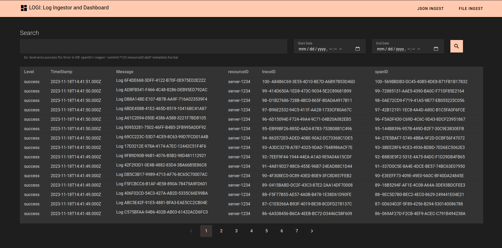
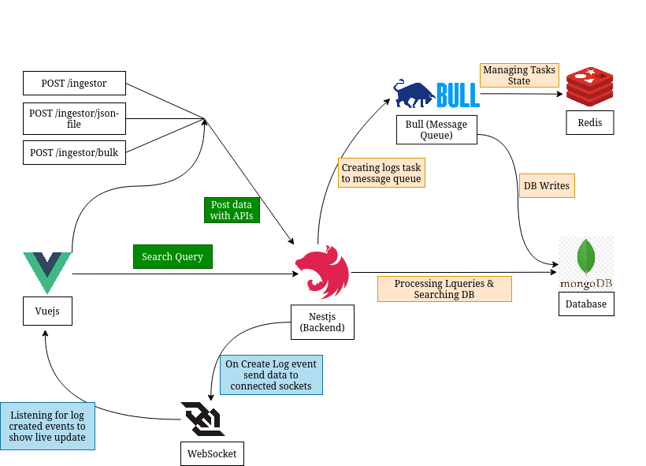

<h3 align="center">LogI: Log Ingestor and Dashboard</h3>

  <p align="center">
Simple Yet Scalable Log Ingestor
</p>
  <p align="center">
Live at <a href="https://dyte-logi.kunwar.dev/"> https://dyte-logi.kunwar.dev/</a> 
</p>


<!-- ABOUT THE PROJECT -->

## About The Project

* LOGI is a log ingestor system tailored to efficiently manage vast volumes of log data.
* It offers seamless handling of data through APIs or a user-friendly Dashboard interface.
* Real time log ingestion and Search Functionalities.
* Paginated Search
* Users can easily query this data using:
    * Full-text search capabilities
    * Specific field filters for precision
* Introducing Lquery, a novel query language that:
    * Handles regular expressions
    * Supports startsWith and endsWith functions
    * Allows combining multiple filters
    * Facilitates nested field queries
    * Enables comprehensive full-text search functionality
    * Search within timestamps
    * Supports Pagination



### Here's why:

<p>The Logi dashboard and the Lquery language serve distinct purposes and enhance the functionality of the LOGI log ingestor system</p>

#### Lquery Language:

* __Advanced Querying__: Offers a specialized language for complex log data searches and filters.
* __Enhanced Search__: Supports intricate searches using regular expressions and various functions.
* __Optimized Data__ Retrieval: Allows precise extraction of relevant information for quicker analysis.

## Built With

### Deployed With

- [Docker](https://www.docker.com/): Platform for containerization and deployment.

### Backend Technologies

- [NestJS](https://nestjs.com/): Backend framework for building scalable applications.
- [Bull (Node.js)](https://github.com/OptimalBits/bull): Redis-backed queue library for Node.js.
- [Redis](https://redis.io/): In-memory data structure store used as a database, cache, and message broker.
- [MongoDB](https://www.mongodb.com/): NoSQL database for flexible, scalable data storage.
- WebSockets
- TypeScript

### Frontend Technologies

- [Vue.js](https://vuejs.org/): Progressive JavaScript framework for building user interfaces.
- [Vuetify](https://vuetifyjs.com/): Material Design component library for Vue.js.
- [Socket.io](https://socket.io/): Real-time bidirectional event-based communication library.

## Installation

#### With Docker

Set Env variables in docker-compose.yml
<br>
__Backend Env__

```
    environment:
      DB_URI: <mongodb-uri>
      REDIS_HOST: <redis-host>
      REDIS_PORT: <redis-port>
```

__Frontend Env__
<br>
Currently the api url is set to https://dyte-logi-api.kunwar.dev. You can change it in docker-compose.yml to use local
api url.

```
    environment:
      VITE_BASE_URL: <Insert API URL Here>
```

__Finally Run the project using__

```bash
docker compose up -d
```

### Design



#### Ensured scalability to handle high volumes of logs efficiently and implemented advanced features.

* __NestJS Architecture__: Utilizing NestJS, that supports modular and scalable architecture,
  enabling efficient handling of increased log volumes by scaling components as needed.
* __Bull (Message Queue)__: For handling background jobs asynchronously, allowing the system to
  handle more requests per second and log processing in distributed manner. Thus, reducing the impact
  I/O-heavy tasks on the main app, preventing bottlenecks caused by blocking
  operations.
* __Optimized DB queries__: Using MongoDB's indexing capabilities to optimize queries for log data retrieval. Using
  text search indexes on multiple fields to improve full text lookups.
* __Horizontal Scaling__: Employing technologies and architectures that support horizontal scaling. This involves
  distributing the workload across multiple instances or nodes.
* __Code Optimization__: Ensuring efficient code practices, including optimizing algorithms, minimizing unnecessary I/O
  operations, and employing best practices for handling large data sets.
* __Docker__: Using docker for easy containerization, ensuring
  scalability through the deployment of multiple instances or microservices as log volumes increase.
* __TypeScript__: Employing TypeScript for backend development, enabling better code maintainability, scalability, and
  error
  detection, contributing to the system's overall scalability and robustness.
* __Websocket Implementation__: For real-time communication, enabling seamless data streaming.
    * __Real-Time Updates__: Utilizing WebSockets to establish a persistent connection between the client and the server
      allows for real-time data transmission.
    * __Websocket Integration__: Utilized _'socket.io-client'_ in Vuejs to implement websockets and subscribe to relevant
      events. Developing Websocket server using socket.io in Nestjs to handle incoming connections and broadcasting
      data.
    * __Live Tail Component__: Made a vuejs service for displaying live log updates. This component
      subscribes to WebSocket events(Log Creation) and updates the UI dynamically as new log data arrives.

## Usage

### Log Ingestion

Backend port running on 3000
<br>

POST /ingestor
<br>
Body:

```json
{
  "level": "success",
  "message": "NewLOGGGG to DB",
  "resourceID": "server-1234",
  "timestamp": "2023-09-15T08:00:00Z",
  "traceID": "abc-xyz-123",
  "spanID": "span-456",
  "commit": "5e5342f",
  "metadata": {
    "parentResourceId": "server-0987"
  }
}
```

POST /ingestor/bulk
<br>
Body:

```json
[
  {
    "level": "success",
    "message": "NewLOGGGG to DB",
    "resourceID": "server-1234",
    "timestamp": "2023-09-15T08:00:00Z",
    "traceID": "abc-xyz-123",
    "spanID": "span-456",
    "commit": "5e5342f",
    "metadata": {
      "parentResourceId": "server-0987"
    }
  }
]
```

POST /ingestor/json-file
<br>
Send Json file which contains __list of logs__ with multipart form with the field __'file'__

#### Head over to <backend-url>/api to see SWAGGER doc

#### You can also use dashboard which is running on port 3001 to send bulk data or json file

--- 

### Dashboard

#### Frontend running on port 3001

* Seamless UI
* Live updates when adding new logs.
* Search box to write Lquery and datetime buttons for lookup between timestamps
* Paginated Searches
* Add logs through UI. With json text or json file.

### Lquery syntax

* Normal lookup

```
foo:bar
```

* Special Keyword to perform Full Text search

```
fts:'full text search query here'
```

* Regex lookup

```
foo:r'regex-code-here'
```

* Match string starting with

```
foo:bar*
```

* Match string ending with

```
foo:*bar
```

* Use multiple filters

```
foo:bar1,bar2,bar3
or
foo:'bar1,bar2,bar3'
```

* Filtering Nested fields

```
foo1.foo2:bar
```

* Filtering logs by date
  * Use dashboard datetime input fields

#### Example Usage
_Create your Lquery syntax and append each of them in space seperated strings_
Example:

```
level:error,success fts:'Error in DB' spanID:r'<regex>' commit:*123 resourceID:abd* metadata.foo:bar
```

## Known Issues

1. Lquery fails when there are multiple spaces between two queries. Ex: <pre> ```"level:success     foo:bar"```</pre>
2. Frontend sends API twice sometimes

## Contact

Kunwar Pratap Singh
<br>
ksingh2001.dev@gmail.com
<br>
Live Project Link: [https://dyte-logi.kunwar.dev/]()
<br>
Project Link: [https://github.com/dyte-submissions/november-2023-hiring-ToxicityMax](Repo Link)